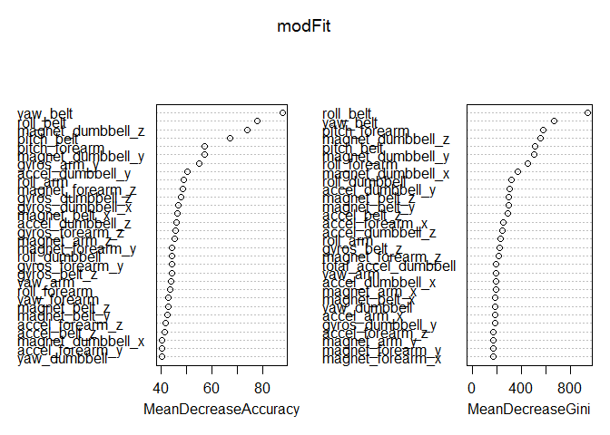

# Human Activity Recognition: Predicting Weight Lifting Exercises

Using devices such as Jawbone Up, Nike FuelBand, and Fitbit, 
it is now possible to collect a large amount of data about personal activity relatively 
inexpensively. In this Human Activity Recognition (HAR) analysis, we create and validiate 
a machine learning model to predict defined weight-lifting exercises.

To build the model, we use data from accelerometers on the belt, forearm, arm, and dumbell 
of 6 participants who were asked to perform barbell lifts correctly and incorrectly in 5 
different ways: exactly according to the specification (Class A), throwing the elbows to the 
front (Class B), lifting the dumbbell only halfway (Class C), lowering the dumbbell only halfway 
(Class D), and throwing the hips to the front (Class E). [1] 

After analyzing and cleaning the data, we create a training dataset to build the model, 
compare its predictive capabilities against a testing dataset, and validate 
its efficacy against 20 supplied test cases.

[1] See the section on the Weight Lifting Exercise Dataset at http://groupware.les.inf.puc-rio.br/har. 

## Loading and Pre-processing the Data

The cloud-based copy of the training data for this analysis is available at 
https://d396qusza40orc.cloudfront.net/predmachlearn/pml-training.csv. The cloud-based copy of 
test data is available at https://d396qusza40orc.cloudfront.net/predmachlearn/pml-testing.csv. 
To prepare the data for processing, we: 

1. Load the necessary packages and download the training dataset (if not already downloaded), 
2. Create an original data frame from the training dataset, marking column values of NA, 
blank, or DIV/0! as NA strings, 
3. Create a subset of original training data frame, eliminating incomplete rows containing NA 
strings, and
4. Create a tidy dataset by removing columns not directly measuring the 
accelerometer data (X, user_name, new_window, num_window, raw_timestamp_part_1, 
raw_timestamp_part_2, and cvtd_timestamp).


```r
require(caret)
require(randomForest)
require(doParallel)
registerDoParallel()

training_file <- "./pml-training.csv"
if (!file.exists(training_file)) {
    urlTraining <- "https://d396qusza40orc.cloudfront.net/predmachlearn/pml-training.csv"
    download.file(urlTraining, destfile = training_file, mode = "wb") 
}
origTrain_df <- data.frame(read.csv(training_file, na.strings = c("NA", "", "#DIV/0!")))
subTrain_df <- origTrain_df[, apply(origTrain_df, 2, function(x) !any(is.na(x)))]
tidyTrain_df <- subset(subTrain_df, select = -c(X, user_name, new_window, num_window, 
    raw_timestamp_part_1, raw_timestamp_part_2, cvtd_timestamp))
```

## Cross-validation

For this analysis, we provide cross-validation by splitting the training data
into training and testing datasets via a 75%/25% split, setting the seed for 
reproducibility. The data is partitioned based on the **classe** variable to 
ensure that the random sampling occurs within each class, preserving the overall 
class distribution of the data. [2] 

[2] http://topepo.github.io/caret/splitting.html


```r
set.seed(42)
inFrame <- createDataPartition(y = tidyTrain_df$classe, p = 0.75, list = F)
training_df <- tidyTrain_df[inFrame, ]
testing_df <- tidyTrain_df[-inFrame, ]
```

## Building the Model

To build the model, we select the Random Forest (RF) algorithm, because it has been shown 
to be unexcelled in accuracy among current algorithms. The RF algorithm also generates an 
internal unbiased estimate of the generalization error as the forest building progresses. [3]
To minimize the Out-of-Bag (OOB) error estimate, we begin by setting the seed for 
reproducibility and searching for the optimal value of **mtry** (the number of variables 
to try splitting on at each node) for the RF algorithm. [4]


```r
set.seed(42)
bestmtry <- tuneRF(training_df[, names(training_df) != "classe"], training_df$classe, 
    ntreeTry=101, stepFactor=1.5,improve=0.01, trace=F, plot=F, dobest=F)
```

As can be seen in the graph below, the optimal **mtry** value is 
*7* and the estimated OOB error is
*0.0054*.


```r
plot(bestmtry)
lines(bestmtry)
```

 

Using this value for **mtry**, we set the seed 
for reproducibility and create our model. As can be seen below, the created model 
has an estimated OOB error rate of *0.46%*.


```r
set.seed(42)
modFit <-randomForest(classe ~ .,data = training_df, mtry = 7, ntree=1001, 
    keep.forest=T, importance=T)
modFit
```

```
## 
## Call:
##  randomForest(formula = classe ~ ., data = training_df, mtry = 7,      ntree = 1001, keep.forest = T, importance = T) 
##                Type of random forest: classification
##                      Number of trees: 1001
## No. of variables tried at each split: 7
## 
##         OOB estimate of  error rate: 0.46%
## Confusion matrix:
##      A    B    C    D    E  class.error
## A 4183    2    0    0    0 0.0004778973
## B   12 2830    6    0    0 0.0063202247
## C    0   17 2548    2    0 0.0074016362
## D    0    0   17 2391    4 0.0087064677
## E    0    0    1    7 2698 0.0029563932
```

The most important variables for the model are summarized in the table below.


```r
varImpPlot(modFit)
```

 

[3] https://www.stat.berkeley.edu/~breiman/RandomForests/cc_home.htm 

[4] http://www.inside-r.org/packages/cran/randomforest/docs/tuneRF

## Testing and Validating the Model


```r
cfTesting <- confusionMatrix(predict(modFit, testing_df), testing_df$classe)
```

We next test the model with our against our testing dataset. As noted in the confusion 
matrix below, the accuracy of the model against the testing dataset is 
*0.9961*.


```r
cfTesting
```

```
## Confusion Matrix and Statistics
## 
##           Reference
## Prediction    A    B    C    D    E
##          A 1395    3    0    0    0
##          B    0  946    5    0    0
##          C    0    0  850   10    0
##          D    0    0    0  794    1
##          E    0    0    0    0  900
## 
## Overall Statistics
##                                          
##                Accuracy : 0.9961         
##                  95% CI : (0.994, 0.9977)
##     No Information Rate : 0.2845         
##     P-Value [Acc > NIR] : < 2.2e-16      
##                                          
##                   Kappa : 0.9951         
##  Mcnemar's Test P-Value : NA             
## 
## Statistics by Class:
## 
##                      Class: A Class: B Class: C Class: D Class: E
## Sensitivity            1.0000   0.9968   0.9942   0.9876   0.9989
## Specificity            0.9991   0.9987   0.9975   0.9998   1.0000
## Pos Pred Value         0.9979   0.9947   0.9884   0.9987   1.0000
## Neg Pred Value         1.0000   0.9992   0.9988   0.9976   0.9998
## Prevalence             0.2845   0.1935   0.1743   0.1639   0.1837
## Detection Rate         0.2845   0.1929   0.1733   0.1619   0.1835
## Detection Prevalence   0.2851   0.1939   0.1754   0.1621   0.1835
## Balanced Accuracy      0.9996   0.9978   0.9958   0.9937   0.9994
```

Finally, we download the validation data if not already downloaded and apply the same 
pre-processing rules that we used on the training data. We test the efficacy of the 
model against 20 pre-supplied test cases. The model successfully predicted the correct 
weight-lifting exercise in all 20 test cases.


```r
testing_file <- "./pml-testing.csv"
if (!file.exists(testing_file)) {
    urlTesting <- "https://d396qusza40orc.cloudfront.net/predmachlearn/pml-testing.csv"
    download.file(urlTesting, destfile = testing_file, mode = "wb") 
}
origValidate_df <- data.frame(read.csv(testing_file, na.strings = c("NA", "", "#DIV/0!")))
subValidate_df <- origValidate_df[, apply(origValidate_df, 2, function(x) !any(is.na(x)))]
tidyValidate_df <- subset(subValidate_df, select = -c(X, user_name, new_window, num_window, 
    raw_timestamp_part_1, raw_timestamp_part_2, cvtd_timestamp, problem_id))

answers <- predict(modFit, tidyValidate_df)

pml_write_files = function(x){
    n = length(x)
    for(i in 1:n){
        filename = paste0("problem_id_",i,".txt")
        write.table(x[i],file=filename,quote=FALSE,row.names=FALSE,col.names=FALSE)
    }
}
pml_write_files(answers)
```

## Summary and Conclusions

The model, using the selected RF algorithm, provided an excellent fit for the data. 
With the continued increase in the amount and availability of data about personal activity, 
analyses such as this should be come more commonplace and useful.

